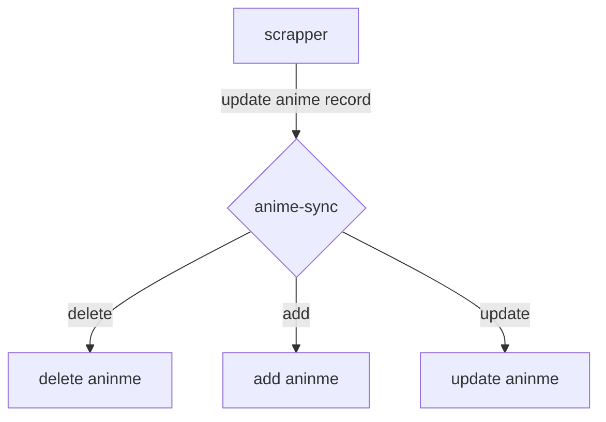

# anime-sync
sync anime search data.

```mermaid
flowchart TD
    A[scrapper] -->|update anime record| B{anime-sync}
    B --> |delete| C[delete aninme]
    B --> |add| D[add aninme]
    B --> |update| E[update aninme]
```

Should be able to handle multiple types of sources. 

current sources:

* pulsar-postgres-source
